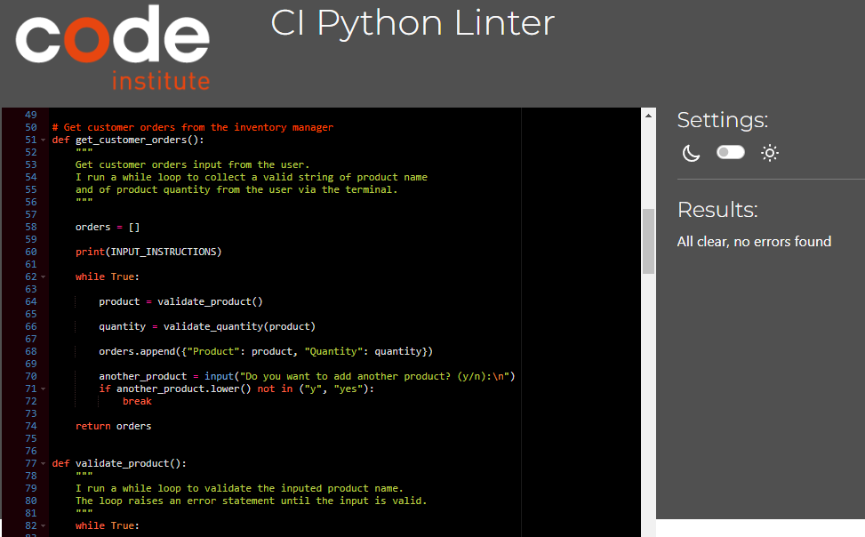

# Smartwatch Hanker

Smartwatch Hanker is an inventory management eCommerce platform designed with Python language, which runs in the Code Institute mock terminal on Heroku.

## Using Smartwatch Hanker

Upon visiting Smartwatch Hanker's platform, the user will be greeted with a welcoming message, and first of all asked if the user wants to update the inventory. If the user answers a 'yes', the user is given the opportunity to add stock values to the inventory, but if the user answers a 'no' or any other character or word, the user is taken to the check inventory step. The platform is responsive to all device types and works effectively on all browser types.

 
Source: [Responsivity measurement](https://ui.dev/amiresponsive?url=https://smartwatch-hanker-d850ba2552c2.herokuapp.com/)

## Features

### • Update Inventory

The first input function in the platform is for updating the inventory. The user is asked to input new stock with values of product name and quantity. The user can input as many new stock as possible and the google worksheet adds every new stock to the bottom of the old stock worksheet in the google spreadsheet of stocks.

### • Getting Customer Orders

The next input function in the platform is for getting the customer orders. This function allows the user input customer ordered products with their corresponding quantities and saves the user's inputs in order to use the inputs to compare with the available stock.

### • Check Inventory

The check inventory input function compares the inputed quantity of each ordered product with the corresponding stock quantity value, for all inputed customer orders. The function further gives report to the user whether there is enough quantity of product in stock to meet the quantity ordered. In the case that the quantity ordered is greater than the quantity in stock, the function tells the user what quantity was orderd and also what quantity is available in stock of the product, so that the user can quickly have a good estimate of what quantity might be required to meet the quantity ordered.

## Technologies Used:

• The platform was created with the Python 3 programming language and gspread and json libraries were imported and used. A google spreadsheet containing a worksheet having all the available stock products and their corresponding quantity values was used. The link to the google spreadsheet is as follows:

[Google Spreadsheet of Stock Values](https://docs.google.com/spreadsheets/d/1g8xChW8Bc8L3gRskRAvlpJbzW4Tld_9Tezh3JE8Ubd8/edit?usp=sharing)

• The workspace used to write the code was:

- Codeanywhere workspace

• All codes and commits were pushed to GitHub repository

• The terminal used to run the code was the Code Institute's Heroku mock terminal:

## Validation Testing

The python code used in the platform was passed through the Code Institute's CI Pycode linter and tested for validation, and no errors were returned.

## Deployment

The eCommerce project was deployed using the Code Institute's Heroku mock terminal as follows:

- The author of the project first of all cloned the repository
- Secondly, a new app was created in the Heroku platform
- Thirdly, the key and value of the creds.json file and another key of "PORT" and value "8000" were all 
  linked to the new app from the GitHub repository
- Buildbacks were set, first to Python and then to NodeJS, in the new app
- The new Heroku app was linked to the repository
- The author then clicked on the "Deploy" button

## Bugs, and How I Fixed Them

I had a challenge with creating a Try/Except block for quantity input validation inside the function for updating inventory. When a letter instead of a number was inputed when asked for quantity, the error message displayed, but after the error message displayed, I was asked again to put in the product name, instead of being directly asked again to input the quantity value in numbers. I solved this challenge by adding a "break" statment after the Try/Except block, which made the immediate overlying parent "while-loop" to be reactivated. This gave me what I desired- I was no more asked to enter a product name again after a quantity value error, but rather directly asked again to enter the quantity value in numbers.

## Contact information

The developer's contact details are as follows:

Email: inekwegoziechukwu@gmail.com

## Acknowledgements and References

- _Deployment Terminal_: The deployment terminal used in the project was created by Code Institute.

- _Google_: All smartwatch names in the google spreadsheet were obtained from the [Google](google.com) search engine.

- _Images_: All images in the README document are placed in the images folder in the github repository.
