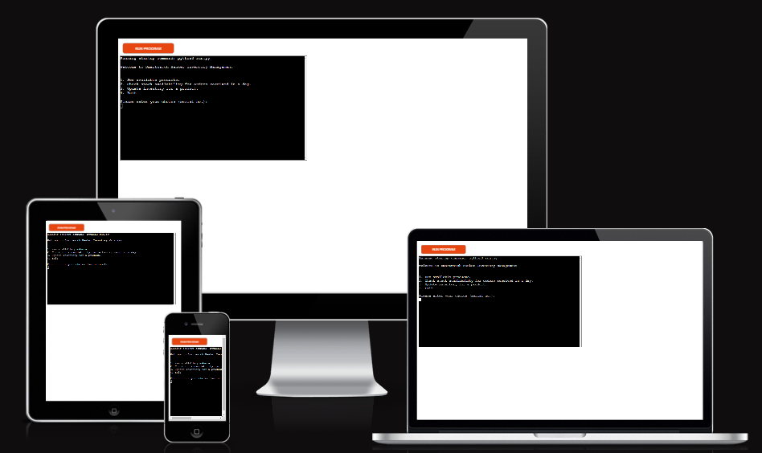
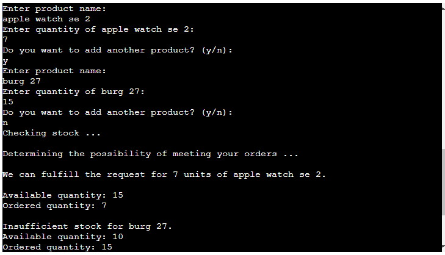

# Smartwatch Hanker

Smartwatch Hanker is an inventory management eCommerce platform designed with Python language, which runs in the Code Institute mock terminal on Heroku.

## Using Smartwatch Hanker

Upon visiting Smartwatch Hanker's platform, the user will be greeted with a welcoming message, and then given a list of operation options from which the user could choose what to do. They options are either to view the available products in stock, check stock availablity for customer orders received in a day, update the inventory or exit the program. The user is then given the opportunity in an input prompt to select what the user wants to do. The platform is responsive to all device types and works effectively on all browser types.

 
Source: [Responsivity measurement](https://ui.dev/amiresponsive?url=https://smartwatch-hanker-d850ba2552c2.herokuapp.com/)

## Features

### • See Inventory Product List

The user is given the opportunity to see the available products in stock in the form of a serial arrangement of the products.

### • Getting Customer Orders

The next input function in the platform is for getting the customer orders. This function allows the user input customer ordered products with their corresponding quantities and saves the user's inputs in order to use the inputs to compare with the available stock.

### • Update Inventory

The first input function in the platform is for updating the inventory. The user is asked to input name of product and quantity of same product. If the product being typed in is not in the list of products, the app gives the user the possibility of adding that product and its quantity value as a new stock. This new stock is added to the table list of stocks in the google worksheet containing the stock data. But if the product typed in by the user is already contained in the list of stocks in the worksheet, the inputed quantity for that product will be added to the old quantity of the product, thus updating the product's quantity. The user can input as many new stocks as possible and the google worksheet adds every new stock to the bottom of the stock worksheet in the google spreadsheet of stocks.

### • Check Inventory

The check inventory input function in the app compares the inputed quantity of each ordered product with the corresponding stock quantity value, for all inputed customer orders. The app, through this function, further gives report to the user whether there is sufficient quantity of product in stock to meet the quantity ordered. In every case, the app additionally tells the user what quantity was orderd and also what quantity is available in stock of the product, so that the user can quickly have a good grasp of what quantity was available and what quantity was ordered.

## Technologies Used:

• The platform was created with the Python 3 programming language and gspread and json libraries were imported and used. A google spreadsheet containing a worksheet having all the available stock products and their corresponding quantity values was used. The link to the google spreadsheet is as follows:

[Google Spreadsheet of Stock Values](https://docs.google.com/spreadsheets/d/1g8xChW8Bc8L3gRskRAvlpJbzW4Tld_9Tezh3JE8Ubd8/edit?usp=sharing)

• The workspace used to write the code was:

- Codeanywhere workspace

• All codes and commits were pushed to GitHub repository

• The terminal used to run the code was the Code Institute's Heroku mock terminal:

## Validation Testing

The python code used in the platform was passed through the Code Institute's CI Pycode linter and tested for validation, and no errors were returned.

## Deployment

The eCommerce project was deployed using the Code Institute's Heroku mock terminal by the following major steps:

- Clone or fork the repository
- Click the "Create a New App" button in the Heroku platform
- Add the key: CREDS and the value of the creds.json file
- Also add the key of "PORT" and value "8000"
- Set buildbacks were set, first to Python and then to NodeJS, in the new app
- Link the app to the repository
- Click on the "Deploy" button (you can either choose the "automatic deploy" or the "manual deploy" option)
- The project was deployed to heroku with the following link: [Smartwatch-Hanker Heroku App](https://smartwatch-hanker-d850ba2552c2.herokuapp.com/)

## Bugs, and How I Fixed Them

I had a challenge with creating a Try/Except block for quantity input validation inside the function for updating inventory. When a letter instead of a number was inputed when asked for quantity, the error message displayed, but after the error message displayed, I was asked again to put in the product name, instead of being directly asked again to input the quantity value in numbers. I solved this challenge by adding a "break" statment after the Try/Except block, which made the immediate overlying parent "while-loop" to be reactivated. This gave me what I desired- I was no more asked to enter a product name again after a quantity value error, but rather directly asked again to enter the quantity value in numbers.

## Contact information

The author's contact details are as follows:

Email: inekwegoziechukwu@gmail.com

## Acknowledgements and References

- _Deployment Steps_: Most of the content of the steps for deployment written above were written in the order and structure of the sample README document given by Code Institute for the Ultimate Battleships game.

- _Deployment Terminal_: The deployment terminal used in the project was created by Code Institute.

- _Google_: All smartwatch names in the google spreadsheet were obtained from the [Google](google.com) search engine.

- _Images_: All images in the README document are placed in the images folder in the github repository.
